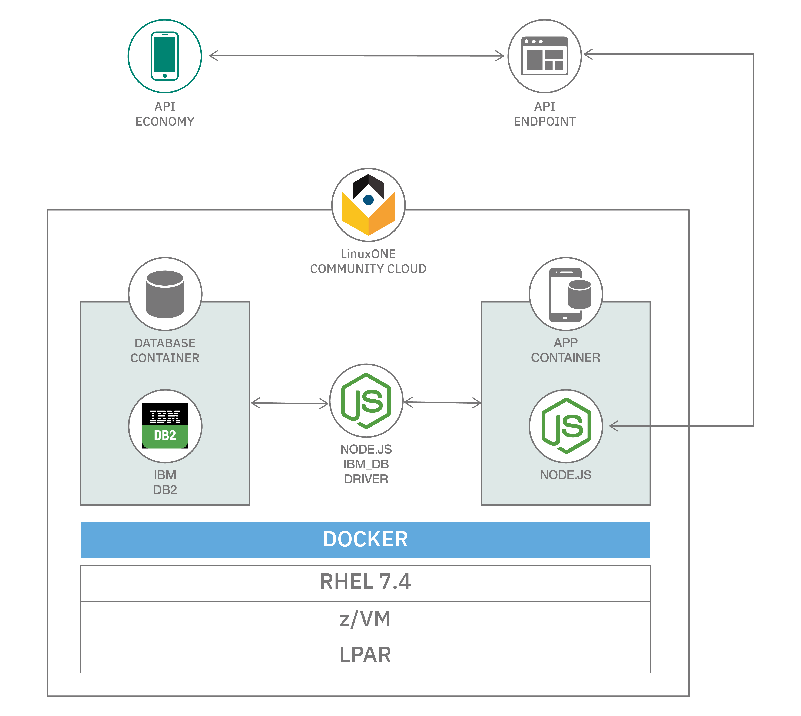

> Use this file to gather the content required for the pattern overview. Copy this draft-patten-template.md file, replace with your own content for each of the sections below, and attach your file to the GitHub tracking issue for your pattern.

> For full details on requirements for each section, see "Write a code pattern overview" on w3 Developer: [https://w3.ibm.com/developer/documentation/write-code-pattern-overview/](https://w3.ibm.com/developer/documentation/write-code-pattern-overview/)

# Short title

> Provide a suggested short title with a maximum of 10 words. The short title must start with a task- or goal-oriented verb; for example, "Build" "Create" "Detect" "Analyze" "Implement" "Write". You can include technologies (e.g. "blockchain"), but no product names.

Deploy microservices hosted on the LinuxONE Community Cloud

# Long title

> Expand on the short title, focusing on open source or generic tools and programs. Include IBM product names only if that product is required in the pattern and cannot be substituted.

Deploy containerized IBM Db2 Movie Database with Node.js API Restful Service 

# Author

> Provide names and IBM email addresses.

* Lehlogonolo Masubelele <Lehlogonolo.Masubelele@ibm.com>
* Phila Dlamini <PhilaD@za.ibm.com>

# URLs

### Github repo

> "Get the code": Provide the link to GitHub repo for the code.

* https://github.ibm.com/Lehlogonolo-Masubelele/imdb_lite

### Other URLs

> "View the demo": Provide the link to YouTube video of a recorded demo of the pattern. This is STRONGLY recommended. If you have other videos of demos or running apps, describe them here and add the URL below.

* Video URL
* Demo URL

# Summary

> Software companies large and small are embracing microservices as a superior approach to application development and management. With microservices, a complex application is broken up into a series of smaller, more specialized services, each with its own database and its own business logic. Microservices then communicate with each other across common interfaces (like APIs) and REST interfaces (like HTTP). Using microservices, development teams can focus on updating specific areas of an application without impacting it, resulting in faster development, testing, and deployment. This developer journey demonstrates how easily you can run microservices hosted on the LinuxONE Community Cloud.

> *Write 2-3 short sentences.*

# Technologies

> Provide the broad categories of technology used or demonstrated in your pattern. IBM Developer uses a standard list of essential and trending technologies identified by OMs, editors, and stakeholders. The first technology that you list will be considered the primary technology.

> To view all components see [https://developer.ibm.com/technologies/](https://developer.ibm.com/technologies/).

* Technology1
* Technology2

# Description

Containerization allows developers to create and deploy applications faster and more securely. With traditional methods, code is developed in a specific computing environment which, when transferred to a new location, often results in bugs and errors. Containerization eliminates this problem by bundling the application code together with the related configuration files, libraries, and dependencies required for it to run. This single package of software or “container” is abstracted away from the host operating system, and hence, it stands alone and becomes portable—able to run across any platform or cloud, free of issues.

One tool that allows you to run containers is called Docker. Docker is an open source software designed to make it easier to create, deploy, and run applications by using containers. LinuxONE was built for open source so you can harness the agility of the open revolution on the industry’s most secure, scalable and high-performing Linux server. In this journey we will show you how to run open source Db2 and Node.js docker images on LinuxONE using Docker.

## Flow

<!--add an image in this path-->

1.  Register a RHEL instance on the LinuxONE Community Cloud.
2.	Install docker.
3.	Create a db2 database container using docker.
4.	Populate the database container with movie records.
5.	Deploy a node.js app container that will expose the db2 database container to an API restful service.
6.	Test the environment using postman and/or your web browser.

# Instructions

> Provide the high-level technical steps that a developer will complete in the pattern (the details for these steps will appear in the readme file). For example, if the developer needs to install and configure a program, step one might be "Download the code from GitHub" and step 2 might be "Configure the code on your local drive." You would provide the full technical details on how to configure the code in the readme file.

> Find the detailed steps for this pattern in the [readme file](https://github.ibm.com/Lehlogonolo-Masubelele/moviedb_api_economy/blob/master/readme-template.md). The steps will show you how to:

1.  Clone the Db2 repo.
2.  Set up your Db2 container.
3.  Clone the Node.js App repo.
4.  Build and Run Node.js App.
5.  Test the environment.

# Included Components & Services

- [LinuxONE](https://www.ibm.com/linuxone/open-source)
- [Docker](https://www.docker.com)
- [Node.js](https://nodejs.org/en/)

# Runtimes

> Indicate languages or environments your pattern code requires, if applicable. (java, javascript/node, .net, swift, go, php, python, ruby, etc.)

* Runtime1

# Related IBM Developer content

> List any IBM Developer resources that are closely related to this pattern, such as other patterns, blog posts, tutorials, etc..

* [title](url): description
* [title](url): description

# Related links

> Provide any non-IBM Developer resources that you need to link to that are NOT components or services

* [title](url): description
* [title](url): description

