The README for a code pattern is very prescriptive, use the following template to get you started.
#3215
<!-- Put badges at the very top -->
<!-- Change the repo -->
[](https://travis-ci.org/IBM/watson-banking-chatbot)

<!-- Add a new Title and fill in the blanks -->
# Deploy containerized  IBM Db2 Movie Database with Node.js API Restful Service
Containerization allows developers to create and deploy applications faster and more securely. With traditional methods, code is developed in a specific computing environment which, when transferred to a new location, often results in bugs and errors. Containerization eliminates this problem by bundling the application code together with the related configuration files, libraries, and dependencies required for it to run. This single package of software or “container” is abstracted away from the host operating system, and hence, it stands alone and becomes portable—able to run across any platform or cloud, free of issues.

One tool that allows you to run containers is called Docker. Docker is an open source software designed to make it easier to create, deploy, and run applications by using containers. LinuxONE was built for open source so you can harness the agility of the open revolution on the industry’s most secure, scalable and high-performing Linux server. In this journey we will show you how to run open source Db2 and Node.js docker images on LinuxONE using Docker.

When you have completed this code pattern, you will understand how to:

* Register for a free LinuxOne community Cloud Virtual Machine
* Set up a Db2 container using docker
* Run a Node.js App in a docker container that exposes the Db2 container to restful API services

<!--Optionally, add flow steps based on the architecture diagram-->
## Flow

<!--add an image in this path-->


1.	Register a RHEL instance on the LinuxONE Community Cloud.
2.	Install docker.
3.	Create a db2 database container using docker.
4.	Populate the database container with movie records.
5.	Deploy a node.js app container that will expose the db2 database container to an API restful service.
6.	Test the environment using postman and/or your web browser.

## Prerequisites

- Register at [LinuxONE Community Cloud](https://developer.ibm.com/linuxone/) for a trial account. We will be using a Ret Hat base image for this journey, so be sure to chose the 'Request your trial' button on the left side of this page.

- [Create your LinuxONE guest](https://github.com/codesenju/hyperledger-fabric-on-linux-one/blob/master/README.md#create-your-linuxone-guest) Remember to to select RHEL instaead of SUSE.

### Install docker
First, we will need to download the correct Docker package archive from [this page](https://www.ibm.com/developerworks/linux/linux390/docker.html).  For version 1.11.2 on RHEL 7.3:
```shell
# wget ftp://ftp.unicamp.br/pub/linuxpatch/s390x/redhat/rhel7.3/docker-17.05.0-ce-rhel7.3-20170523.tar.gz
```

Then, unpack the archive and copy the docker binaries:
```shell
# tar -xzvf docker-17.05.0-ce-rhel7.3-20170523.tar.gz
# cp docker-17.05.0-ce-rhel7.3-20170523/docker* /usr/local/bin/
```

And then start the docker daemon:
```shell
# docker daemon -g /local/docker/lib &
```
You should see something similar to this:
```shell
[root@devjourney07 ~]# docker daemon -g /local/docker/lib &
[1] 2332
[root@devjourney07 ~]# INFO[0000] New containerd process, pid: 2338

WARN[0000] containerd: low RLIMIT_NOFILE changing to max  current=1024 max=4096
WARN[0001] devmapper: Usage of loopback devices is strongly discouraged for production use. Please use `--storage-opt dm.thinpooldev` or use `man docker` to refer to dm.thinpooldev section.
INFO[0001] devmapper: Creating filesystem xfs on device docker-94:2-263097-base
INFO[0001] devmapper: Successfully created filesystem xfs on device docker-94:2-263097-base
INFO[0001] Graph migration to content-addressability took 0.00 seconds
INFO[0001] Firewalld running: false
INFO[0001] Default bridge (docker0) is assigned with an IP address 172.17.0.0/16. Daemon option --bip can be used to set a preferred IP address
INFO[0001] Loading containers: start.

INFO[0001] Loading containers: done.
INFO[0001] Daemon has completed initialization
INFO[0001] Docker daemon                                 commit=b9f10c9-unsupported graphdriver=devicemapper version=1.11.2
INFO[0001] API listen on /var/run/docker.sock
```

# Steps

Follow these steps to setup and run this code pattern. The steps are described in detail below.

1. [Clone the Db2 repo](#1-Clone-the-Db2-repo).
2. [Set up your Db2 container](#2-Set-up-your-Db2-container).
3. [Clone the Node.js App repo](#3-Clone-the-Node.js-App-repo).
4. [Build and Run Node.js App](#4-Build-and-Run-Node.js-App).
5. [Test the environment](#5-Test-the-environment).

### 1. Clone the Db2 repo

Clone the `imdb_lite` repo after logging into your LinuxOne Community Cloud Rhel Virtual Machine. In a terminal, run:

```bash
git clone https://github.com/codesenju/imdb_lite.git
cd imdb_lite
```

We’ll be using the file [`data.tar.gz`](https://mega.nz/#!BF0BRYAY!9vIGSwVtLU_FYtJf87WaxnAcrcaBHgJzDiGSInP359k) which has the records for the movie database.
* Copy the data.tar.gz into your folder /imdb_lite.
<br>
<p align="center">
  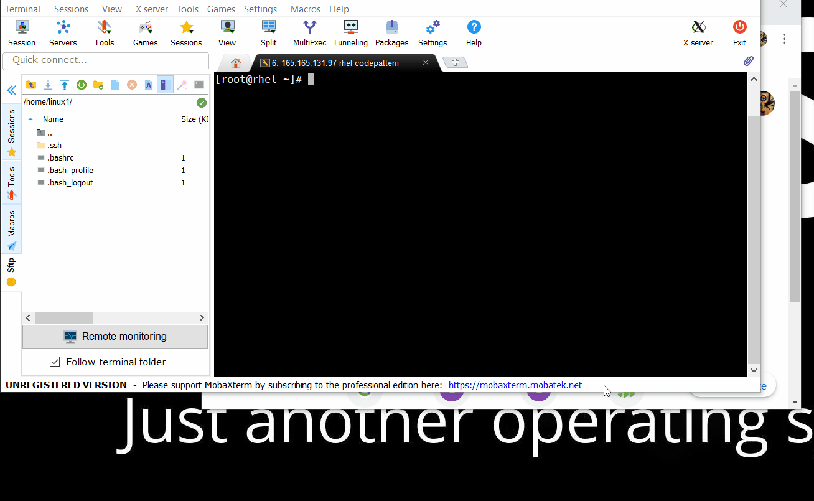
</p>
<br>

* Run the command `` ls -alh `` to view directory contents and if your directory looks similar to the image bellow you can move on to the next step to build your db2 image.

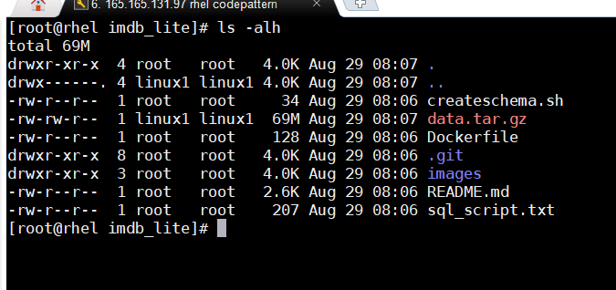

### 2. Set up your Db2 container

- Build your db2 image.

```bash
rm -rf images/ #first lets remove unnecessary files
docker build -t codesenju/imdb_lite .
```
<br>
<p align="center">
  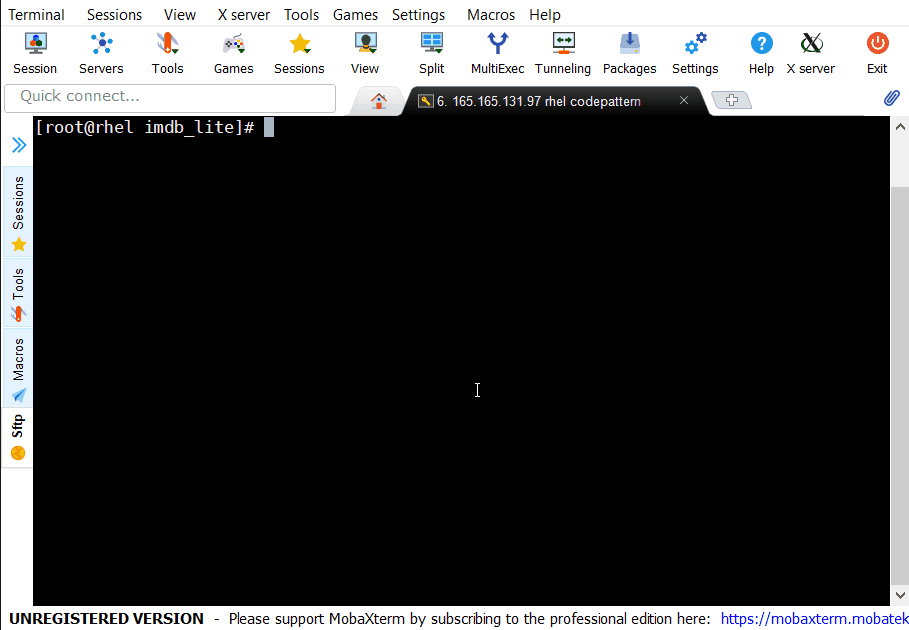
</p>
<br>

 - After successful build, run the command `` docker images `` to see your image loaded into docker. On completion, you should see the following output on console:

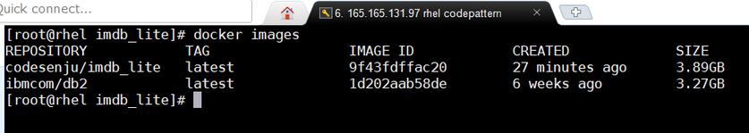

- Create a container network that will be used by your two micro services.

```bash 
docker network create mynet
```

- Run your db2 image as a container.

```bash
docker run -itd --net mynet --name micro_db2 --privileged=true -p 50000:50000 -e LICENSE=accept -e DB2INST1_PASSWORD=db2admin -e DBNAME= -v /usr/src/app:/database codesenju/imdb_lite
```
<br>
<p align="center">
  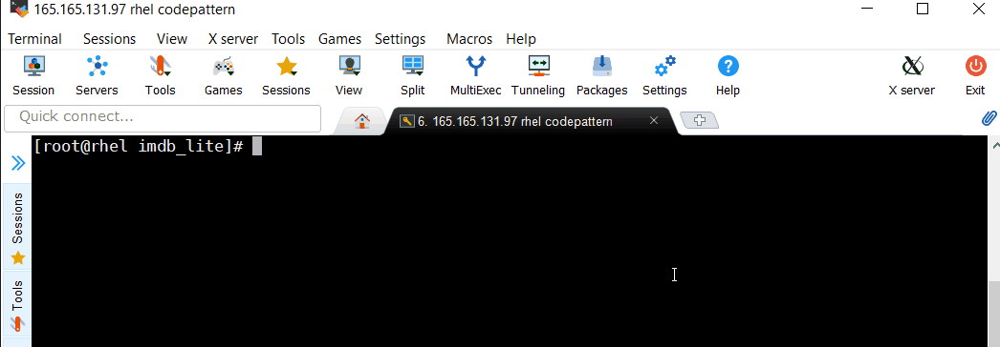
</p>
<br>

  - After successfully executing the last command you can check if you have a container instance of db2 running by executing the following command:
   
```bash
docker ps
```

 - You should see the following output on console:
   
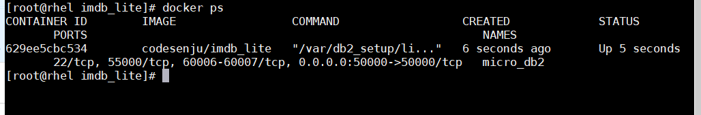

- Now we going to login into the db2 container and configure the database schema.

```bash
docker exec -ti <CONTAINER-ID> bash -c "su - db2inst1"
cd /var/custom
./createschema.sh
```
<br>
<p align="center">
  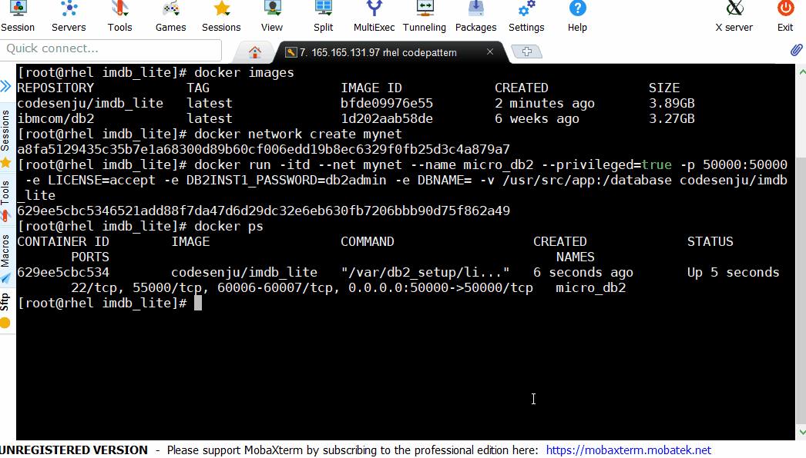
</p>
<br>

 - When you're done exit the container with ``exit``.

### 3. Clone the Node.js App repo

```bash
cd ~
git clone https://github.com/codesenju/nodejs_api4db2.git
cd nodejs_api4db2
```

### 4. Build and Run Node.js App

```bash
docker build -t codesenju/nodejs_api4db2 .
docker run --net mynet -p 49160:8081 -d codesenju/nodejs_api4db2
```
<br>
<p align="center">
  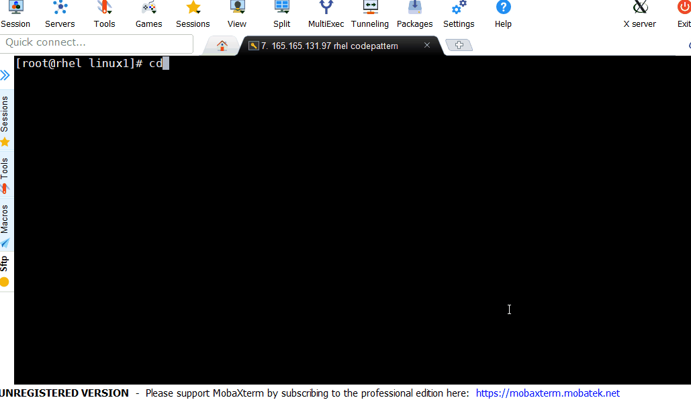
</p>
<br>

### 5. Test the environment

* Test within the LinuxOne machine using cURL:
```bash
curl localhost:49160
curl localhost:49160/api/all
```
<br>
<p align="center">
  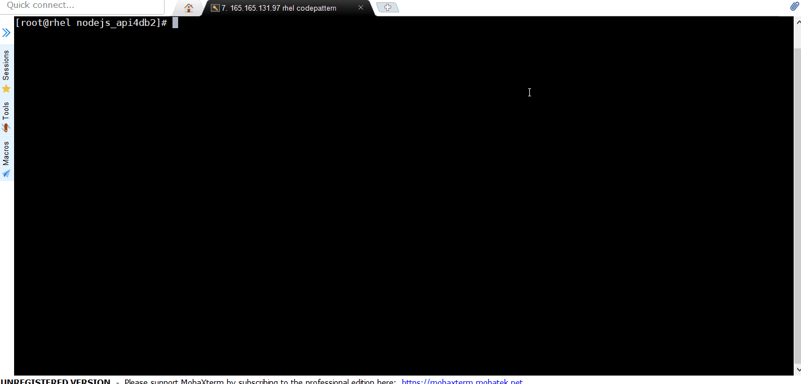
</p>
<br>

* Test from any browser by entering the following url:
```bash
<vm-ip>:49160/ # replace <vm-ip> with your LinuxOne machine IP address.
<vm-ip>:49160/api/all
```
<br>
<p align="center">
  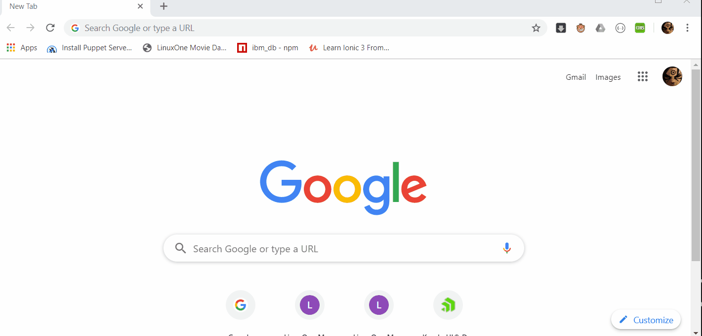
</p>
<br>

* Test with <a href="https://www.getpostman.com/downloads/" target="_blank">Postman</a>:
```bash
<vm-ip>:49160/ # replace <vm-ip> with your LinuxOne machine IP address.
<vm-ip>:49160/api/all
```
<br>
<br>
<p align="center">
  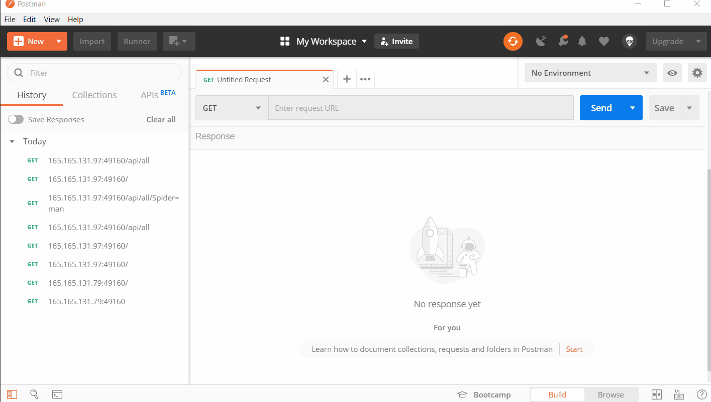
</p>
<br>


# Troubleshooting

* Error: Environment {GUID} is still not active, retry once status is active

  > This is common during the first run. The app tries to start before the Watson Discovery
environment is fully created. Allow a minute or two to pass. The environment should
be usable on restart. If you used **Deploy to IBM Cloud** the restart should be automatic.

* Error: Only one free environment is allowed per organization

  > To work with a free trial, a small free Watson Discovery environment is created. If you already have
a Watson Discovery environment, this will fail. If you are not using Watson Discovery, check for an old
service thay you might want to delete. Otherwise, use the `.env DISCOVERY_ENVIRONMENT_ID` to tell
the app which environment you want it to use. A collection will be created in this environment
using the default configuration.

<!-- keep this -->
## License

This code pattern is licensed under the Apache License, Version 2. Separate third-party code objects invoked within this code pattern are licensed by their respective providers pursuant to their own separate licenses. Contributions are subject to the [Developer Certificate of Origin, Version 1.1](https://developercertificate.org/) and the [Apache License, Version 2](https://www.apache.org/licenses/LICENSE-2.0.txt).

[Apache License FAQ](https://www.apache.org/foundation/license-faq.html#WhatDoesItMEAN)
